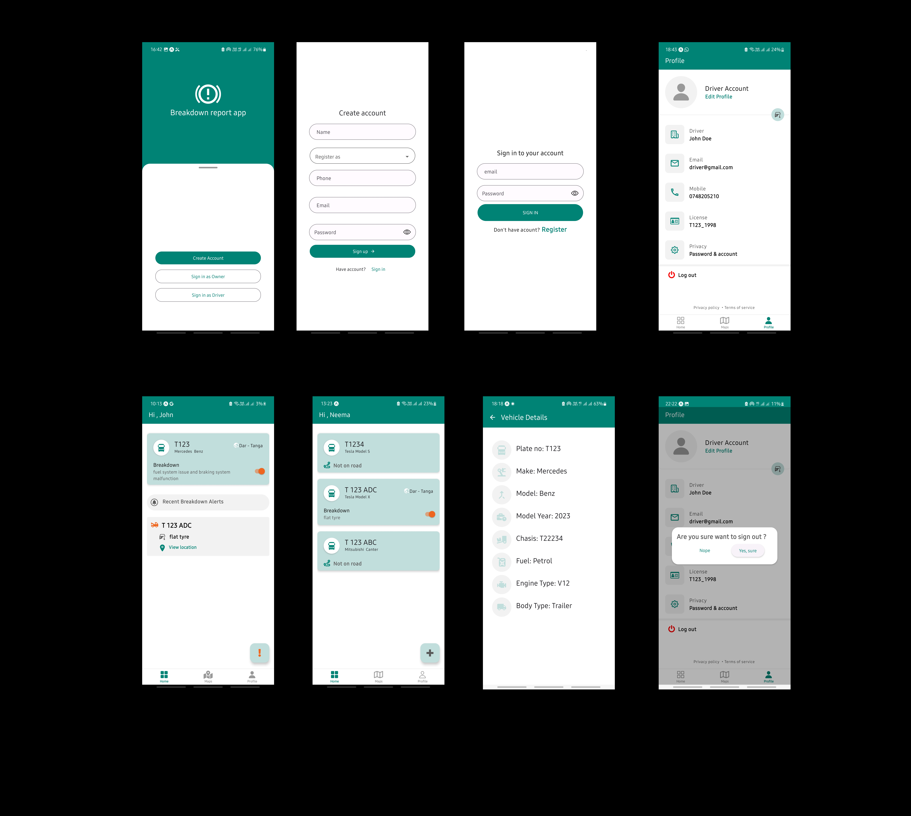

# Nihelp - Mobile App for Drivers' Assistance

## Table of Contents

1. [Introduction](#introduction)
2. [Features](#features)
3. [Folder Structure](#folder-structure)
4. [Tech Stack](#tech-stack)
5. [Preview](#preview)
6. [Getting Started](#getting-started)
7. [License](#license)

## Introduction

Nihelp is a mobile app designed to assist drivers by enabling them to seek help from other cars on the same route in case of breakdowns or emergencies. It also provides vehicle owners with the ability to manage their vehicles and track the status of breakdowns. The app utilizes a folder structure to maintain organization and utilizes a variety of technologies to deliver a seamless experience to its users.

## Features

- Breakdown and Emergency Assistance: Drivers can request help from nearby users when faced with a breakdown or emergency situation on the road.
- Real-Time Communication: The app facilitates real-time communication between drivers, ensuring prompt responses to assistance requests.
- Location-Based Assistance: Nihelp uses GPS technology to identify nearby drivers who can offer help.
- Vehicle Management (Owners): Vehicle owners can perform CRUD operations (Create, Read, Update, Delete) to manage their vehicles, including adding new vehicles, updating details, and deleting old ones.
- Breakdown Status Tracking (Owners): Owners can view the status of their vehicles' breakdowns, enabling them to monitor the resolution process effectively.
- Breakdowns Map (Drivers): Drivers can see the locations of vehicles that have experienced breakdowns on a map, helping them identify where their assistance might be needed.
- Sign Up and Login (Drivers and Owners): Both drivers and owners can sign up and log in to their accounts to access the app's features.
- Driver Sign In: Drivers can log in using their license plate number, allowing them to sign in with the vehicle they are currently driving.
- Push Notifications: Owners and drivers on the same route will receive push notifications when there is a nearby breakdown request that matches their location.
- Route Tracking: The app tracks the route of the user, making it easier for other drivers to locate them and provide assistance.
- User Ratings and Reviews: After receiving help, users can rate and review the assistance provided, building a trustworthy community.
- User Profiles: Each user has a profile containing relevant information, such as their car details and assistance history.

## Folder Structure

The Nihelp mobile app has the following folder structure:

- src
  - components: Contains reusable React components used across different screens.
  - api: Handles communication with the backend server and API calls.
  - features: Holds feature-specific components and logic, organized by feature names.
  - layouts: Contains layout components that define the overall app structure.
  - redux: Includes Redux-related files, such as actions, reducers, and store configuration.
  - screens: Contains individual screen components that make up the app's UI.
  - navigations: Handles navigation between different screens using React Navigation.
  - helpers: Contains utility functions and helper modules used throughout the app.

## Tech Stack

The Nihelp app is built using the following tech stack:

- Expo: A framework that simplifies the development of React Native applications and provides various tools and libraries for app-building.
- Redux Toolkit: A package that simplifies the implementation of Redux by reducing boilerplate code.
- Axios: A popular JavaScript library used to make HTTP requests from the app to the backend server.
- Prettier: An opinionated code formatter that helps maintain consistent code style across the project.
- React Native Paper: A library that provides Material Design components for React Native applications, ensuring a consistent and visually appealing UI.
- Push Notification Service: A service that enables the app to send push notifications to users based on their location and preferences.

## Preview



## Getting Started

To run the Nihelp mobile app on your local machine, follow these steps:

1. Clone the repository from GitHub:
   ```
   git clone https://github.com/your-username/nihelp-mobile-app.git
   ```
2. Change into the project directory:
   ```
   cd nihelp-mobile-app
   ```
3. Install the dependencies:
   ```
   npm install
   ```
4. Start the Expo development server:
   ```
   npm start
   ```
5. Use the Expo Go app on your mobile device to scan the QR code displayed in the terminal or web browser to launch the app.

The app should now be up and running on your device, and you can start exploring its features.

## License

The Nihelp mobile app is licensed under the MIT License. Feel free to use, modify, and distribute the app in accordance with the terms specified in the license.
